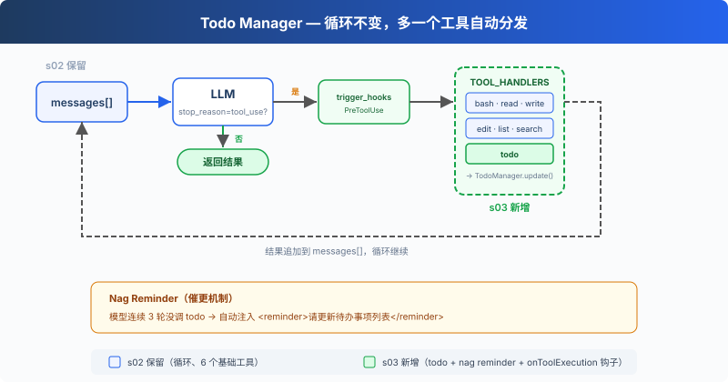

# AI智能体工程 - Agent03 (Module 03)

> *"没有计划的 agent 走哪算哪"* -- 先列步骤再动手，完成率翻倍

## 项目简介

Agent03 在 Agent02 的基础上引入了**待办事项管理 (TodoManager)** 和**自动提醒机制**。通过继承 ZQAgent 并重写 `onToolExecution()` 钩子, 实现了强制 AI 维护任务列表的功能, 解决了多步任务中模型容易丢失进度的问题。

### 核心特性

- **继承模式**: Agent03 首次采用 `extends ZQAgent` 继承模式, 可重写父类方法
- **TodoManager 待办管理**: 版本追踪 + 状态验证 + synchronized 线程安全
- **自动提醒机制**: 3 轮未更新待办列表时, 通过 `onToolExecution()` 自动注入 `<reminder>`
- **单任务聚焦**: 同一时间只允许一个 `in_progress` 任务, 强制顺序执行
- **会话持久化与恢复**: `SessionManager` 把每条消息自动落盘到 `.sessions/<sessionId>.json`；启动时交互式列出历史会话或开新会话
- **纯文本回复可见**: 每次 `create` 后调用 `printText()` 打印 assistant 的文本块, 避免纯文本回复被静默吞掉
- **截断告警**: 命中 `MAX_TOKENS` 时调用 `warnIfTruncated()` 打印警告, 避免工具调用被静默截断导致死循环
- **错误处理**: 工具未找到、执行异常等场景都会被标记为 `isError=true` 回灌给模型
- **交互式会话选择**: 支持 `java Agent03 <sessionId>` 直接恢复指定会话, 或交互式选择历史会话
- **7 个工具**: 6 个文件操作工具 + 1 个 todo 管理工具

## 实现原理

### 架构设计



### 核心组件

| 组件 | 职责 |
|------|------|
| `Agent03` | 主智能体类, 继承 ZQAgent, 通过 `bootstrapSession(args)` 装配会话, 重写 `onToolExecution()` 实现自动提醒 |
| `ZQAgent` | 基础智能体, 实现工具调用循环、会话同步、文本打印和截断告警 |
| `session/SessionManager` | 会话管理器, 启动时恢复历史、运行时持久化每条消息、记录 token 使用 |
| `session/SessionStore` | `.sessions/<id>.json` 文件读写 |
| `session/MessageConverter` | `MessageParam` ↔ 可序列化 `SessionMessage` 互转 |
| `tool/manager/TodoManager` | 待办管理器, 版本追踪、状态验证、synchronized 线程安全 |
| `tool/ToolDefinition` | 工具定义 (含 TodoDefinition) |
| `tool/schema/TodoInput` | Todo 输入 Schema |
| `tool/schema/TodoItem` | Todo 项 Schema |

#### 1. Agent03 (继承 ZQAgent)

Agent03 从组合模式 (Agent01/02) 转为**继承模式**, 通过 `extends ZQAgent` 获得对内部钩子方法的访问权限:

```java
public class Agent03 extends ZQAgent {
    public static TodoManager todoManager;    // 静态共享, ToolDefinition 可引用
    private int roundsSinceTodo = 0;          // 距上次更新 todo 的轮数
    private long lastTodoVersion = 0;         // 上次记录的 todo 版本

    public Agent03(AnthropicClient client, String model,
                   List<ToolDefinition> tools, TodoManager todoManager) {
        super(client, model, tools);
        Agent03.todoManager = todoManager;
        this.lastTodoVersion = todoManager.getVersion();
    }
}
```

**设计要点**:
- `todoManager` 是 `static` 字段 -- 因为 `TodoDefinition` 的 handler 引用 `Agent03.todoManager::updateTodos`, 需要在静态上下文中访问
- `roundsSinceTodo` 计数器追踪模型连续多少轮没有调用 todo 工具
- `lastTodoVersion` 记录上次检测到的版本, 与当前版本对比判断是否有更新

#### 2. onToolExecution() 钩子 -- 自动提醒

Agent03 重写了 ZQAgent 的 `onToolExecution()` 方法, 在每次工具执行后检查是否需要注入提醒:

```java
@Override
protected void onToolExecution(List<ContentBlockParam> toolResults) {
    long currentVersion = todoManager.getVersion();
    if (currentVersion > lastTodoVersion) {
        roundsSinceTodo = 0;
        lastTodoVersion = currentVersion;
    } else {
        roundsSinceTodo++;
    }

    if (roundsSinceTodo >= 3) {
        String reminder = String.format("""
                <reminder>
                您已经 %d 个回合没有更新待办事项列表了。请更新列表以反映当前进度。
                </reminder>
                """, roundsSinceTodo);
        toolResults.add(ContentBlockParam.ofText(
                TextBlockParam.builder().text(reminder).build()));
    }
}
```

**工作流程**:
1. 每次工具执行后, 检查 `todoManager.version` 是否变化
2. 版本变了 (说明模型调用了 todo 工具) → 重置计数器
3. 版本没变 → 计数器 +1
4. 计数器 ≥ 3 → 向 `toolResults` 注入 `<reminder>` 文本块

#### 3. TodoManager -- 待办管理器

```java
public class TodoManager {
    private final List<TodoItem> todos = new ArrayList<>();
    private long version = 0;

    public String updateTodos(String input) {
        TodoInput todoInput = mapper.readValue(input, TodoInput.class);
        return update(todoInput.getTodos());
    }

    public synchronized String update(List<TodoItem> items) {
        // 验证每项: content 非空, status ∈ {pending, in_progress, completed}
        // 约束: max 20 项, in_progress ≤ 1
        this.todos.clear();
        this.todos.addAll(validated);
        this.version++;
        return render();
    }

    public synchronized String render() {
        // [ ] pending  [>] in_progress <- activeForm  [x] completed
        // 末尾追加 "(done/total 已完成)"
    }

    public synchronized boolean hasOpenItems() {
        return todos.stream().anyMatch(t -> !"completed".equals(t.getStatus()));
    }
}
```

**约束规则**:
- 最多 20 个待办事项
- 同时只能有 1 个 `in_progress` 状态的任务
- `content` 不能为空
- `status` 必须是 `pending` / `in_progress` / `completed` 之一

**渲染格式**:
```
[ ] 创建项目目录
[>] 编写 utils.py <- 正在编写工具类
[x] 初始化配置文件

(1/3 已完成)
```

#### 4. TodoDefinition -- 嵌套 JSON Schema

todo 工具使用复杂的嵌套 JSON Schema, 定义了 `todos` 数组中每个项的结构:

```java
public static ToolDefinition TodoDefinition = new ToolDefinition(
        "todo",
        "管理待办事项列表。支持添加、更新或完成任务。",
        createInputSchema(
                Map.of("todos", Map.of(
                        "type", "array",
                        "description", "待办事项列表",
                        "items", Map.of(
                                "type", "object",
                                "properties", Map.of(
                                        "id", Map.of("type", "string", "description", "任务的唯一标识符"),
                                        "content", Map.of("type", "string", "description", "待办事项的内容描述"),
                                        "status", Map.of("type", "string",
                                                "enum", List.of("pending", "in_progress", "completed"),
                                                "description", "任务状态")
                                ),
                                "required", List.of("id", "content", "status")
                        )
                )),
                List.of("todos")),
        TodoInput.class,
        Agent03.todoManager::updateTodos
);
```

**关键设计**: handler 使用 `Agent03.todoManager::updateTodos` 方法引用, 通过静态字段访问 TodoManager 实例。

## 使用方法

### 环境要求

- Java 17+
- Maven 3.6+
- Anthropic API Key 或兼容的 API 服务

### 配置

API 配置位于 `AIConstants.java`:

```java
public static final String BASE_URL = "https://hoppinzq.com:520/deepseek/anthropic";
public static final String API_KEY = "your-api-key-here";
public static final String MODEL = "deepseek-v4-flash";
```

### 编译运行

```bash
# 编译项目
mvn clean compile

# 运行 Agent03
mvn exec:java -Dexec.mainClass="com.hoppinzq.agent.Agent03"
```

### 交互示例

#### 会话恢复
```bash
# 直接恢复指定会话
mvn exec:java -Dexec.mainClass="com.hoppinzq.agent.Agent03" -Dexec.args="20250115-143022"

# 或无参数启动, 交互式选择历史会话
mvn exec:java -Dexec.mainClass="com.hoppinzq.agent.Agent03"
```

#### Todo 工具调用示例
```
用户: 帮我创建一个 Python 项目，包含 utils.py 和 tests 目录

AI: [调用 todo 工具]
    todos: [{id:"1", content:"创建项目根目录", status:"pending"},
            {id:"2", content:"创建 utils.py 文件", status:"pending"},
            {id:"3", content:"创建 tests 目录", status:"pending"}]

    返回:
    [ ] 创建项目根目录
    [ ] 创建 utils.py 文件
    [ ] 创建 tests 目录
    (0/3 已完成)

AI: [调用 bash 工具] mkdir -p myproject/tests

AI: [调用 todo 工具] 更新任务状态

    返回:
    [x] 创建项目根目录
    [>] 创建 utils.py 文件
    [ ] 创建 tests 目录
    (1/3 已完成)
```

#### 会话统计命令
```
/stats  # 查看当前会话的 token 统计
/usage  # 查看 token 使用明细
/exit   # 退出程序
```

## 项目结构

```
hoppinzq-module-agent-03/
├── src/main/java/com/hoppinzq/agent/
│   ├── Agent03.java                    # 主智能体类 (extends ZQAgent + bootstrapSession)
│   ├── base/
│   │   └── ZQAgent.java                # 基础智能体 (工具调用循环 + 会话同步 + printText + warnIfTruncated)
│   ├── session/                        # 会话持久化与恢复
│   │   ├── SessionManager.java         # 会话管理器 (恢复历史 / 运行时持久化 / token统计)
│   │   ├── SessionStore.java           # .sessions/<id>.json 文件读写
│   │   ├── MessageConverter.java       # MessageParam ↔ SessionMessage 互转
│   │   ├── SessionMessage.java         # 可序列化的消息块
│   │   ├── SessionBlock.java           # 单个内容块的序列化表示
│   │   ├── SessionData.java            # 会话完整数据 (消息列表 + 元信息)
│   │   └── TokenUsage.java             # Token 使用统计
│   ├── tool/
│   │   ├── ToolDefinition.java         # 工具定义 (含 TodoDefinition)
│   │   ├── Tools.java                  # 工具实现
│   │   ├── manager/
│   │   │   └── TodoManager.java        # 待办管理器
│   │   └── schema/
│   │       ├── BashInput.java          # Bash 输入 Schema
│   │       ├── ReadFileInput.java      # read_file 输入 Schema
│   │       ├── WriteFileInput.java     # write_file 输入 Schema
│   │       ├── EditFileInput.java      # edit_file 输入 Schema
│   │       ├── ListFilesInput.java     # list_files 输入 Schema
│   │       ├── ContentSearchInput.java # content_search 输入 Schema
│   │       ├── TodoInput.java          # Todo 输入 Schema
│   │       └── TodoItem.java           # Todo 项 Schema
│   └── constant/
│       └── AIConstants.java            # 常量配置 (API/模型/路径/MAX_TOKENS)
├── .sessions/                          # 运行时生成, 存放每个会话的 JSON 快照
├── pom.xml
├── README.md
└── s3.md
```

## 技术栈

| 技术 | 版本 | 用途 |
|------|------|------|
| Java | 17+ | 编程语言 |
| Maven | 3.6+ | 构建工具 |
| Anthropic Java SDK | -- | Claude API 调用 |
| OkHttp | -- | HTTP 客户端 |
| Jackson | -- | JSON 序列化/反序列化 |
| Lombok | -- | @Getter/@Data 等注解 |
| SLF4J | -- | 日志框架 |

## 注意事项

1. **API密钥安全**: 不要将 API 密钥提交到版本控制系统
2. **命令执行风险**: Bash 工具可执行任意命令, 生产环境需添加安全限制
3. **日志控制**: `AIConstants.LOG_ENABLE = false` 关闭日志；MCP stdio 模式下严禁使用 `System.out`
4. **会话存储**: `.sessions/` 目录存放会话快照, 可定期清理旧会话释放空间
5. **编码处理**: Windows 命令输出使用 GBK 编码读取
6. **Todo 约束**: 最多 20 个待办事项, 同时只能有 1 个 `in_progress` 任务

## 设计亮点

1. **继承模式转型**: 从 Agent01/02 的组合模式转向继承模式, 获得钩子方法访问权限
2. **静态字段桥接**: `todoManager` 作为 static 字段, 解决 ToolDefinition handler 的引用问题
3. **版本追踪**: 通过 `version` 字段精确检测 todo 是否被更新, 而非依赖工具调用顺序
4. **双约束策略**: "最多 20 项" + "仅 1 个 in_progress" 双重约束, 防止计划膨胀和注意力分散
5. **synchronized 线程安全**: TodoManager 所有读写方法均使用 synchronized, 保证并发安全
6. **会话自动持久化**: 每次 `appendMessage()` 都通过 `SessionManager.onMessageAppended()` 自动落盘, 无需手动保存
7. **交互式会话选择**: 启动时自动列出历史会话, 用户可输入序号恢复或直接回车开新会话
8. **自动提醒机制**: 通过重写 `onToolExecution()` 钩子, 在 3 轮未更新 todo 时自动注入 `<reminder>`

## 扩展开发

### 自定义提醒策略

继承 Agent03 并重写 `onToolExecution()`:

```java
@Override
protected void onToolExecution(List<ContentBlockParam> toolResults) {
    // 自定义提醒逻辑, 例如改为 5 轮触发
    if (roundsSinceTodo >= 5) {
        // 自定义提醒消息
    }
}
```

### 自定义待办约束

修改 TodoManager 的 `update()` 方法, 调整约束规则:

```java
// 例如: 允许同时 3 个 in_progress
if (inProgressCount > 3) {
    throw new IllegalArgumentException("同时最多 3 个进行中的任务");
}
```

## 相关资源

- [Anthropic API 文档](https://docs.anthropic.com/)
- [Claude API SDK](https://github.com/anthropics/anthropic-sdk-java)
- 项目系列文档: s3.md
